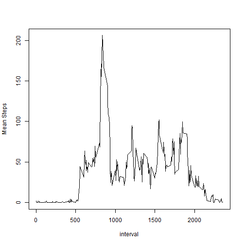
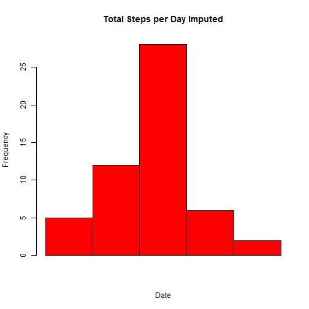
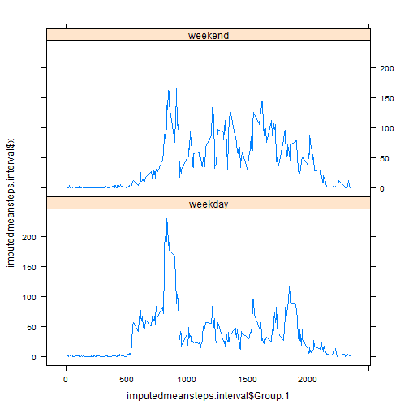

Loading and preprocessing the data

```r
temp<-tempfile()
download.file("https://d396qusza40orc.cloudfront.net/repdata%2Fdata%2Factivity.zip", temp)
data <- read.csv(unz(temp, "activity.csv"))
unlink(temp)
```

Calculate the mean total number of steps taken per day

```r
options("scipen"=100, "digits"=4)
stepsperday<-aggregate(steps ~ date, data = data, sum)
hist(stepsperday$steps, xlab= "Date", col = "red", main = "Total Steps per Day", xaxt="n")
```

 

```r
meanstepsperday<-aggregate(steps ~ date, data = data, mean)
medianstepsperday<-aggregate(steps ~ date, data = data, median)
meanstepsperday
```

```
##          date   steps
## 1  2012-10-02  0.4375
## 2  2012-10-03 39.4167
## 3  2012-10-04 42.0694
## 4  2012-10-05 46.1597
## 5  2012-10-06 53.5417
## 6  2012-10-07 38.2465
## 7  2012-10-09 44.4826
## 8  2012-10-10 34.3750
## 9  2012-10-11 35.7778
## 10 2012-10-12 60.3542
## 11 2012-10-13 43.1458
## 12 2012-10-14 52.4236
## 13 2012-10-15 35.2049
## 14 2012-10-16 52.3750
## 15 2012-10-17 46.7083
## 16 2012-10-18 34.9167
## 17 2012-10-19 41.0729
## 18 2012-10-20 36.0938
## 19 2012-10-21 30.6285
## 20 2012-10-22 46.7361
## 21 2012-10-23 30.9653
## 22 2012-10-24 29.0104
## 23 2012-10-25  8.6528
## 24 2012-10-26 23.5347
## 25 2012-10-27 35.1354
## 26 2012-10-28 39.7847
## 27 2012-10-29 17.4236
## 28 2012-10-30 34.0938
## 29 2012-10-31 53.5208
## 30 2012-11-02 36.8056
## 31 2012-11-03 36.7049
## 32 2012-11-05 36.2465
## 33 2012-11-06 28.9375
## 34 2012-11-07 44.7326
## 35 2012-11-08 11.1771
## 36 2012-11-11 43.7778
## 37 2012-11-12 37.3785
## 38 2012-11-13 25.4722
## 39 2012-11-15  0.1424
## 40 2012-11-16 18.8924
## 41 2012-11-17 49.7882
## 42 2012-11-18 52.4653
## 43 2012-11-19 30.6979
## 44 2012-11-20 15.5278
## 45 2012-11-21 44.3993
## 46 2012-11-22 70.9271
## 47 2012-11-23 73.5903
## 48 2012-11-24 50.2708
## 49 2012-11-25 41.0903
## 50 2012-11-26 38.7569
## 51 2012-11-27 47.3819
## 52 2012-11-28 35.3576
## 53 2012-11-29 24.4688
```

```r
medianstepsperday
```

```
##          date steps
## 1  2012-10-02     0
## 2  2012-10-03     0
## 3  2012-10-04     0
## 4  2012-10-05     0
## 5  2012-10-06     0
## 6  2012-10-07     0
## 7  2012-10-09     0
## 8  2012-10-10     0
## 9  2012-10-11     0
## 10 2012-10-12     0
## 11 2012-10-13     0
## 12 2012-10-14     0
## 13 2012-10-15     0
## 14 2012-10-16     0
## 15 2012-10-17     0
## 16 2012-10-18     0
## 17 2012-10-19     0
## 18 2012-10-20     0
## 19 2012-10-21     0
## 20 2012-10-22     0
## 21 2012-10-23     0
## 22 2012-10-24     0
## 23 2012-10-25     0
## 24 2012-10-26     0
## 25 2012-10-27     0
## 26 2012-10-28     0
## 27 2012-10-29     0
## 28 2012-10-30     0
## 29 2012-10-31     0
## 30 2012-11-02     0
## 31 2012-11-03     0
## 32 2012-11-05     0
## 33 2012-11-06     0
## 34 2012-11-07     0
## 35 2012-11-08     0
## 36 2012-11-11     0
## 37 2012-11-12     0
## 38 2012-11-13     0
## 39 2012-11-15     0
## 40 2012-11-16     0
## 41 2012-11-17     0
## 42 2012-11-18     0
## 43 2012-11-19     0
## 44 2012-11-20     0
## 45 2012-11-21     0
## 46 2012-11-22     0
## 47 2012-11-23     0
## 48 2012-11-24     0
## 49 2012-11-25     0
## 50 2012-11-26     0
## 51 2012-11-27     0
## 52 2012-11-28     0
## 53 2012-11-29     0
```

Find out the average daily activity pattern

```r
meanstepsperinterval<-aggregate(steps ~ interval, data = data, mean)
with(meanstepsperinterval, plot(interval, steps, type ="l", xlab ="interval", ylab = "Mean Steps"))
```

 

```r
maxstepsinterval<-meanstepsperinterval[which.max(meanstepsperinterval$steps),]
```
The 835 interval, on average across all the days in the dataset, contains the maximum number of steps.

Imputing missing values

```r
numberofmissings<-sum(is.na(data$steps))
missingvalues<-unique(data[is.na(data$steps),])
missingdays<-unique(missingvalues$date)
gooddata<-data[!is.na(data$steps),]
missingvalues$steps<-meanstepsperinterval$steps
imputedata<-rbind(gooddata, missingvalues)
hist(stepsperday$steps, xlab= "Date", col = "red", main = "Total Steps per Day Imputed", xaxt="n")
```

 

```r
imputemeanstepsperday<-aggregate(steps ~ date, data = imputedata, mean)
imputemedianstepsperday<-aggregate(steps ~ date, data = imputedata, median)
```
The total number of missing values in the dataset is 2304.
These missing values were replaced with the average steps per 5 mins interval across days.
The mean steps taken per day was calcualted after imputation.

```
##          date   steps
## 1  2012-10-01 37.3826
## 2  2012-10-02  0.4375
## 3  2012-10-03 39.4167
## 4  2012-10-04 42.0694
## 5  2012-10-05 46.1597
## 6  2012-10-06 53.5417
## 7  2012-10-07 38.2465
## 8  2012-10-08 37.3826
## 9  2012-10-09 44.4826
## 10 2012-10-10 34.3750
## 11 2012-10-11 35.7778
## 12 2012-10-12 60.3542
## 13 2012-10-13 43.1458
## 14 2012-10-14 52.4236
## 15 2012-10-15 35.2049
## 16 2012-10-16 52.3750
## 17 2012-10-17 46.7083
## 18 2012-10-18 34.9167
## 19 2012-10-19 41.0729
## 20 2012-10-20 36.0938
## 21 2012-10-21 30.6285
## 22 2012-10-22 46.7361
## 23 2012-10-23 30.9653
## 24 2012-10-24 29.0104
## 25 2012-10-25  8.6528
## 26 2012-10-26 23.5347
## 27 2012-10-27 35.1354
## 28 2012-10-28 39.7847
## 29 2012-10-29 17.4236
## 30 2012-10-30 34.0938
## 31 2012-10-31 53.5208
## 32 2012-11-01 37.3826
## 33 2012-11-02 36.8056
## 34 2012-11-03 36.7049
## 35 2012-11-04 37.3826
## 36 2012-11-05 36.2465
## 37 2012-11-06 28.9375
## 38 2012-11-07 44.7326
## 39 2012-11-08 11.1771
## 40 2012-11-09 37.3826
## 41 2012-11-10 37.3826
## 42 2012-11-11 43.7778
## 43 2012-11-12 37.3785
## 44 2012-11-13 25.4722
## 45 2012-11-14 37.3826
## 46 2012-11-15  0.1424
## 47 2012-11-16 18.8924
## 48 2012-11-17 49.7882
## 49 2012-11-18 52.4653
## 50 2012-11-19 30.6979
## 51 2012-11-20 15.5278
## 52 2012-11-21 44.3993
## 53 2012-11-22 70.9271
## 54 2012-11-23 73.5903
## 55 2012-11-24 50.2708
## 56 2012-11-25 41.0903
## 57 2012-11-26 38.7569
## 58 2012-11-27 47.3819
## 59 2012-11-28 35.3576
## 60 2012-11-29 24.4688
## 61 2012-11-30 37.3826
```
The median steps taken per day was calcualted after imputation

```
##          date steps
## 1  2012-10-01 34.11
## 2  2012-10-02  0.00
## 3  2012-10-03  0.00
## 4  2012-10-04  0.00
## 5  2012-10-05  0.00
## 6  2012-10-06  0.00
## 7  2012-10-07  0.00
## 8  2012-10-08 34.11
## 9  2012-10-09  0.00
## 10 2012-10-10  0.00
## 11 2012-10-11  0.00
## 12 2012-10-12  0.00
## 13 2012-10-13  0.00
## 14 2012-10-14  0.00
## 15 2012-10-15  0.00
## 16 2012-10-16  0.00
## 17 2012-10-17  0.00
## 18 2012-10-18  0.00
## 19 2012-10-19  0.00
## 20 2012-10-20  0.00
## 21 2012-10-21  0.00
## 22 2012-10-22  0.00
## 23 2012-10-23  0.00
## 24 2012-10-24  0.00
## 25 2012-10-25  0.00
## 26 2012-10-26  0.00
## 27 2012-10-27  0.00
## 28 2012-10-28  0.00
## 29 2012-10-29  0.00
## 30 2012-10-30  0.00
## 31 2012-10-31  0.00
## 32 2012-11-01 34.11
## 33 2012-11-02  0.00
## 34 2012-11-03  0.00
## 35 2012-11-04 34.11
## 36 2012-11-05  0.00
## 37 2012-11-06  0.00
## 38 2012-11-07  0.00
## 39 2012-11-08  0.00
## 40 2012-11-09 34.11
## 41 2012-11-10 34.11
## 42 2012-11-11  0.00
## 43 2012-11-12  0.00
## 44 2012-11-13  0.00
## 45 2012-11-14 34.11
## 46 2012-11-15  0.00
## 47 2012-11-16  0.00
## 48 2012-11-17  0.00
## 49 2012-11-18  0.00
## 50 2012-11-19  0.00
## 51 2012-11-20  0.00
## 52 2012-11-21  0.00
## 53 2012-11-22  0.00
## 54 2012-11-23  0.00
## 55 2012-11-24  0.00
## 56 2012-11-25  0.00
## 57 2012-11-26  0.00
## 58 2012-11-27  0.00
## 59 2012-11-28  0.00
## 60 2012-11-29  0.00
## 61 2012-11-30 34.11
```
These values do not differ from the estimates from the first part of the assignment, except the changes on the estimates of the missing days through giving some estimates. By imputing missing data, it increases the estimates of the total daily number of steps in the missing days.

There are differences in activity patterns between weekdays and weekends as showing below.

```r
imputedata$day<-weekdays(as.Date(imputedata$date))
imputedata$day[imputedata$day=="Sunday"]<-"weekend"
imputedata$day[imputedata$day=="Saturday"]<-"weekend"
imputedata$day[imputedata$day=="Monday"]<-"weekday"
imputedata$day[imputedata$day=="Tuesday"]<-"weekday"
imputedata$day[imputedata$day=="Wednesday"]<-"weekday"
imputedata$day[imputedata$day=="Thursday"]<-"weekday"
imputedata$day[imputedata$day=="Friday"]<-"weekday"
imputedmeansteps.interval<-aggregate(imputedata$steps,data = imputedata, by=list(imputedata$interval, imputedata$day), mean)

library(lattice)
```

```
## Warning: package 'lattice' was built under R version 3.2.2
```

```r
f<-factor(imputedata$day, labels = c("weekend", "weekday"))
xyplot(imputedmeansteps.interval$x ~ imputedmeansteps.interval$Group.1 | imputedmeansteps.interval$Group.2, type = "l", layout =c(1,2))
```

 

